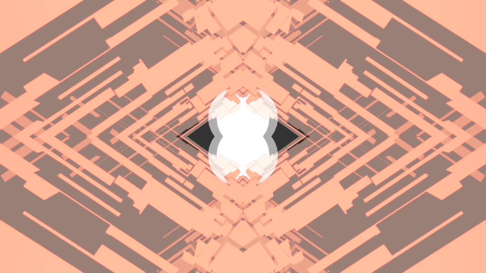

This project is proof of concept 3D demo made with minimal dependencies (SDL2, OpenGL, and written in very C-like C++).
This has become abandonware since starting a new job. I uploaded this repo primarily for historical reference, but perhaps this will be interesting for someone learning OpenGL.

Features
--------
- Load and render 3D models exported from blender (.obj)
- Various effects shaders
- FPS-style camera controls with mouse.

Screenshots
-----------

